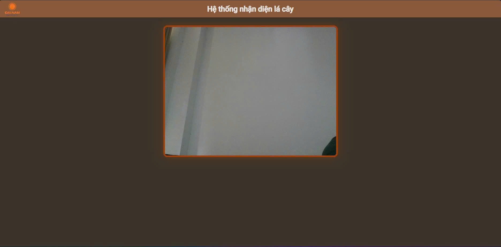

# 🍃 NHẬN DIỆN LÁ CÂY BẰNG YOLOv8

Hệ thống nhận diện bệnh lá cây theo thời gian thực bằng mô hình YOLOv8, sử dụng camera máy tính và hiển thị kết quả lên giao diện web được thiết kế đẹp mắt theo tông màu cam, có logo trường.

---

## 📸 Demo tính năng

- ✅ Nhận diện lá hoặc bệnh lá cây từ camera theo thời gian thực.
- ✅ Hiển thị kết quả trực tiếp lên giao diện web.
- ✅ Giao diện dễ tùy chỉnh, dễ mở rộng.

---


## ⚙️ Yêu cầu hệ thống

- Python 3.8 trở lên
- Camera máy tính (webcam)
- Trình duyệt hiện đại (Chrome, Firefox, Edge...)

---  
## 🖼 Giao diện




---

## 🔧 Cài đặt

1. **Cài đặt thư viện cần thiết:**

```bash
pip install flask opencv-python ultralytics

python -m venv venv
source venv/bin/activate      # Linux / Mac
venv\Scripts\activate         # Windows
